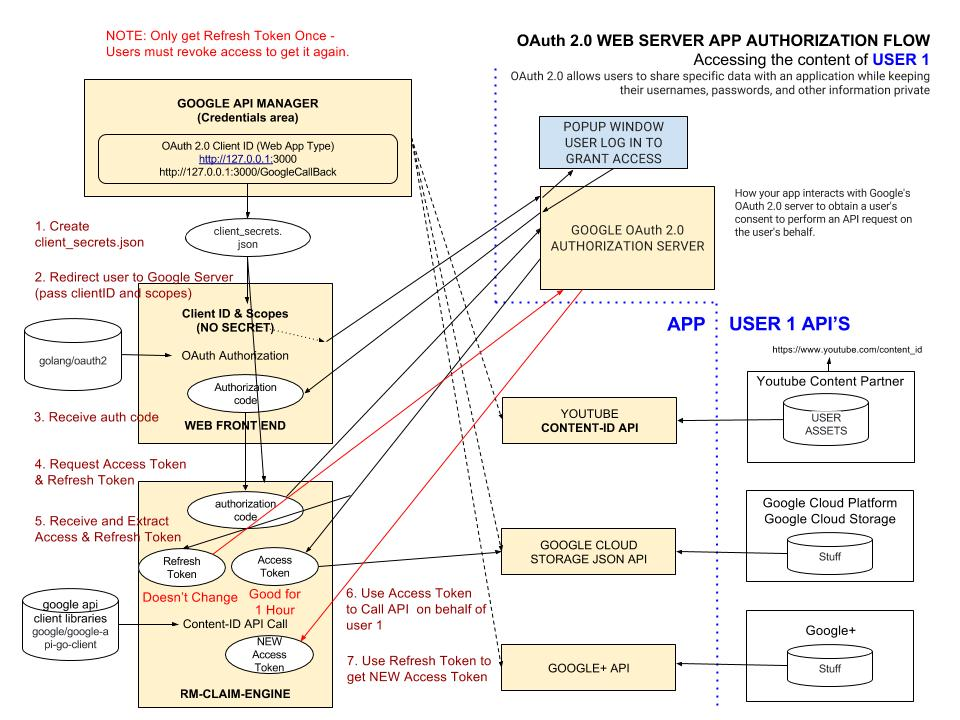

# OAuth 2.0 WEB SERVER APP AUTHERIZATION CHEAT SHEET

`OAuth 2.0 Web Server Side Authorization Flow` _allows users to authenticate themselfs
in order for an APP to gain access to their information via an API._

[GitHub Webpage](https://jeffdecola.github.io/my-cheat-sheets/)

## HIGH-LEVEL VIEW

The following diagram illustrates how everything fits for
Web Server-Side Flow. To accesss a users info they must be
in your g-suite domain.

## STEP 1 - CREATE OAuth 2.0 CLIENT ID & SECRET

To create Create a `OAuth 2.0 Client ID` goto credentials page
[here](https://console.developers.google.com/projectselector/apis/credentials)
and select create credentials.

Create a OAuth 2.0 client IDs for a Web Application.

You will now have a Client ID and a Secret.

## STEP 2 - USER GETS REDIRECTED TO LOGIN TO ACCOUNT

The user opens the website and clicks the login button.

## STEP 3 - GET AUTHORIZATION CODE

You can use the `golang/oauth2` client libraries
[here](https://github.com/golang/oauth2)
to implement OAuth 2.0 in your application.

## STEP 4 - USER AUTH CODE TO GET TOKEN (ACCESS AND REFRESH)

Use the code you get to obtain a an

* Access Token: Good for one hour.
* Refresh Token : Only get once. Save this. Good forever until user revokes.

You only get a refresh token if you specified
access_type as offline when getting auth code.  Meaning
the user can be offline but you may use the refresh token to
get a new access token.

## STEP 5 - USE ACCESS TOKEN TO CALL API

You can use the `google/google-api-go-client` client libraries
[here](https://github.com/google/google-api-go-client)
to use APIs in your application.
